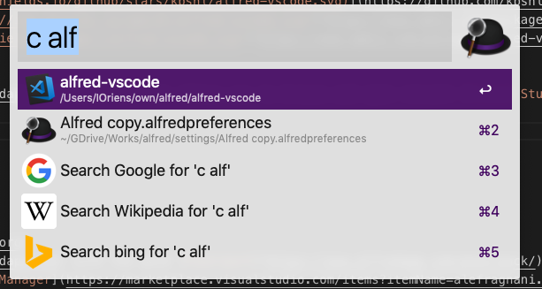

# alfred-vscode2


> [Alfred 3](https://www.alfredapp.com) workflow that allows you to browse and open rencent [Visual Studio Code](https://code.visualstudio.com/) projects or simply open specified folders/files.



## Prerequisites

You need

- [Node.js 8+](https://nodejs.org)
- [Alfred 3](https://www.alfredapp.com) with the paid [Powerpack](https://www.alfredapp.com/powerpack/) upgrade
- [Visual Studio Code Command Line](https://code.visualstudio.com/docs/setup/mac)

## Installation

```bash
npm install --global alfred-vscode2
```

**Note for Insiders Edition users:**

Remember to set the `vscodeEdition` variable to `code` in the Workflow Configuration!

**Note for VSCodium users:**

Remember to set the `vscodeEdition` variable to `codium` in the Workflow Configuration!

It defaults to `code`.

## Usage

### Projects

Simply type `c` followed by space to list all projects. Optionally type a query to search for a
specific project or group. The overall list shows 100 projects at max.

Select a project and press <kbd>Enter</kbd> to open it in VS Code or Code Insiders.

Hold <kbd>Alt</kbd> when pressing <kbd>Enter</kbd> to open the project path in Terminal - You can set
the terminal app in the Workflow variables view.

Hold <kbd>Shift</kbd> when pressing <kbd>Enter</kbd> to open the project path in Finder.

### Folders / Files

Type `vs` followed by space and search for a specific folder or file to open in Visual Studio Code.

Hold <kbd>Shift</kbd> when pressing <kbd>Enter</kbd> to open that folder or file in a new VS Code window.

## Special Thanks

Big Thanks goes to [Cloudstek](https://github.com/Cloudstek) for his [Alfred Atom Workflow](https://github.com/Cloudstek/alfred-atom) which I used as a base for this project.
